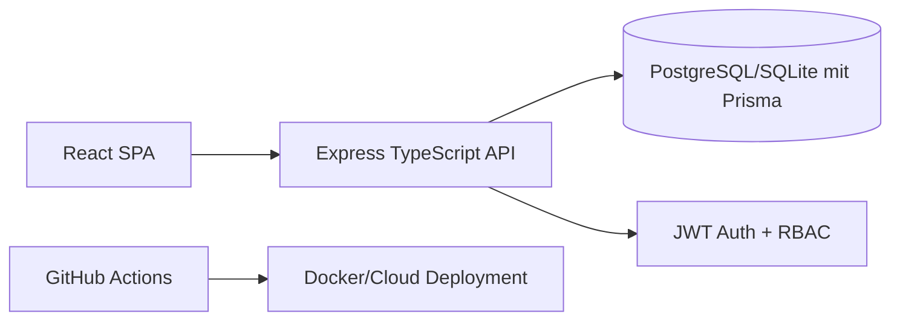

# Architekturdiagramm

```mermaid
flowchart LR
  UI[React SPA] --> API[Express TypeScript API]
  API --> DB[(PostgreSQL/SQLite mit Prisma)]
  API --> Auth[JWT Auth + RBAC]
  CI[GitHub Actions] --> Deploy[Docker/Cloud Deployment]
```

## Module
- Benutzerverwaltung
- Produktmanagement
- Lager
- Einkauf
- Verkauf
- Finanzen
- Reporting
